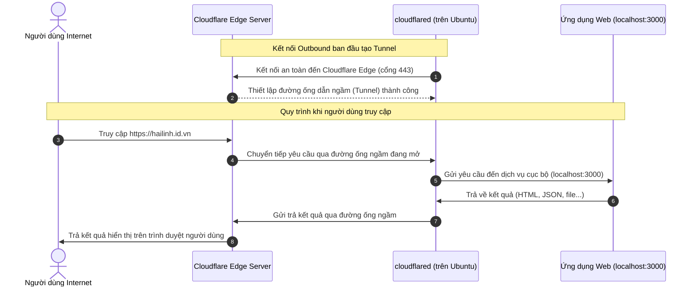

# Hướng Dẫn Kỹ Thuật: Cloudflare DNS & Cloudflare Tunnel

Tài liệu này tổng hợp kiến thức về cách hoạt động của hệ thống DNS Cloudflare, cơ chế hoạt động của Cloudflare Tunnel, và so sánh chi tiết giữa phương pháp triển khai truyền thống (Public IP) với phương pháp hiện đại (Tunnel).

---

## 1. Tổng Quan Kiến Trúc & Bối Cảnh

*   **Tên miền đăng ký:** `hailinh.id.vn` (mua tại nhà đăng ký **iNET**).
*   **Quản lý DNS:** Trỏ Nameservers về **Cloudflare** (`emily.ns.cloudflare.com`, `patryk.ns.cloudflare.com`).
*   **Phương thức kết nối:** Thiết lập **Cloudflare Tunnel** chạy ngầm (System Service) trên máy chủ Ubuntu tại công ty để kết nối ứng dụng nội bộ ra ngoài Internet mà không cần mở cổng mạng (Port Forwarding).

---

## 2. Trao Quyền Quản Lý Domain (iNET -> Cloudflare)

Khi bạn cấu hình DNS Nameservers tại iNET trỏ về Cloudflare, bạn đang thực hiện quy trình **nhượng quyền phân giải tên miền**:

*   **Nhà đăng ký tên miền (Registrar - iNET):** Giữ quyền sở hữu pháp lý đối với tên miền. Bạn trả tiền hàng năm cho iNET để duy trì tên miền `hailinh.id.vn`.
*   **Nhà cung cấp DNS (DNS Provider - Cloudflare):** Đóng vai trò là "người dẫn đường". Khi người dùng truy cập tên miền của bạn, hệ thống DNS toàn cầu sẽ hỏi Cloudflare xem tên miền này trỏ đi đâu.
*   **Tại sao lại chuyển sang Cloudflare?** Để tận dụng bộ lọc an ninh (chống DDoS, Tường lửa WAF), bộ nhớ đệm (CDN) giúp tăng tốc độ tải trang, và đặc biệt là khả năng kết nối ẩn danh thông qua Cloudflare Tunnel.

---

## 3. Bản Ghi DNS (DNS Records) Là Gì?

Bản ghi DNS giống như danh bạ điện thoại của Internet, ánh xạ các tên miền dễ nhớ (như `hailinh.id.vn`) sang các chỉ dẫn kỹ thuật mà máy tính hiểu được.

### Các loại bản ghi phổ biến:
1.  **Bản ghi A (Address):** Ánh xạ trực tiếp một tên miền/subdomain tới một địa chỉ **IPv4 công cộng** (ví dụ: `server.brandloop.io.vn` trỏ về IP `14.169.112.163`).
2.  **Bản ghi CNAME (Canonical Name):** Đóng vai trò như một biệt danh (alias), ánh xạ một tên miền sang một tên miền khác (ví dụ: `brandloop.io.vn` trỏ sang tên miền của Cloudflare Pages là `brandloop.pages.dev`).
3.  **Bản ghi MX (Mail Exchanger):** Cấu hình máy chủ nhận mail (ví dụ: Google Workspace, Zoho Mail). Nếu bạn muốn dùng email doanh nghiệp như `admin@hailinh.id.vn`, bạn bắt buộc phải cấu hình bản ghi này.
4.  **Bản ghi TXT (Text):** Lưu trữ thông tin văn bản thô, dùng để xác thực sở hữu tên miền (cho Google Search Console, Facebook Pixel) hoặc bảo mật email (SPF, DKIM).
5.  **Bản ghi HTTPS / HTTP (Bản ghi đặc biệt):** Đây là tiêu chuẩn kỹ thuật DNS mới giúp tối ưu hóa bảo mật và tốc độ mã hóa cho trình duyệt. **Bạn không cần tạo bản ghi HTTPS này để xuất bản website thông thường.** Website vẫn chạy dựa trên bản ghi A, CNAME hoặc thông qua Tunnel.

### Giải thích các Khuyến nghị (Recommendations) thường gặp của Cloudflare:
*   **"Visitors cannot reach www.hailinh.id.vn":** Xảy ra khi bạn chỉ chạy Tunnel cho domain gốc `hailinh.id.vn`. Để sửa, bạn hãy nhấn **Add record** -> chọn loại **CNAME** -> Name là `www` -> Target điền `@` (kí tự `@` đại diện cho tên miền gốc). Lúc này ai gõ `www.hailinh.id.vn` cũng sẽ truy cập được qua Tunnel.
*   **"Email cannot reach @hailinh.id.vn addresses...":** Cảnh báo tên miền chưa cấu hình nhận mail (thiếu bản ghi MX). Nếu bạn không có nhu cầu dùng email cho tên miền này, hãy **bỏ qua hoàn toàn** cảnh báo này mà không cần lo lắng.

---

## 4. So Sánh Chi Tiết: Public IP (Truyền Thống) vs. Cloudflare Tunnel (Đường Ống Ngầm)

Dưới đây là bảng so sánh chi tiết giữa hai phương pháp triển khai:

| Tiêu Chí So Sánh | Triển Khai Qua Public IP (Truyền Thống) | Triển Khai Qua Cloudflare Tunnel (Hiện Đại) |
| :--- | :--- | :--- |
| **Bản chất kết nối** | **Inbound Connection** (Ngoài đi vào). Người dùng kết nối trực tiếp đến IP của máy chủ. | **Outbound Connection** (Trong đi ra). Máy chủ tự kết nối ra Cloudflare để tạo đường ống ngầm. |
| **Bản ghi DNS hiển thị** | Hiển thị loại **A / AAAA** trỏ thẳng về IP mạng của bạn (ví dụ: `14.169.112.163`). | Hiển thị loại **Tunnel** (Thực chất ngầm là CNAME trỏ về `<tunnel-id>.cfargotunnel.com`). |
| **Cấu hình Router/Modem** | Bắt buộc phải cấu hình **Port Forwarding** (mở các cổng 80, 443, 3000...) trên modem nhà mạng. | **Không cần** cấu hình modem. Không cần mở bất kỳ cổng kết nối chiều vào (Inbound port) nào. |
| **Bảo mật mạng** | **Thấp.** Địa chỉ IP thật của máy chủ bị lộ. Hacker có thể quét các cổng mở để thực hiện tấn công trực tiếp. | **Rất cao.** IP thật được ẩn hoàn toàn. Không có cổng nào mở trên firewall nên giảm thiểu tối đa bề mặt tấn công. |
| **Yêu cầu IP tĩnh** | Cần có IP tĩnh từ nhà mạng hoặc phải sử dụng phần mềm cập nhật IP động (DDNS - Dynamic DNS) phức tạp. | **Không cần IP tĩnh.** Dù IP mạng của bạn có thay đổi liên tục thì đường ống ngầm vẫn tự duy trì kết nối bình thường. |
| **Vượt tường lửa (NAT)** | Gần như **không thể** nếu máy chủ nằm sau các tường lửa nghiêm ngặt của mạng doanh nghiệp/văn phòng. | **Vượt tường lửa cực tốt.** Chỉ cần máy chủ kết nối được Internet ra ngoài (cổng 443) là thiết lập được Tunnel. |
| **Quản lý SSL/HTTPS** | Bạn phải tự cấu hình chứng chỉ SSL (Let's Encrypt, Nginx) trên máy chủ của mình. | Cloudflare tự động cấp và gia hạn chứng chỉ SSL miễn phí ở đầu vào Edge của họ. |

---

## 5. Cơ Chế Hoạt Động Của Cloudflare Tunnel

Quy trình kết nối và xử lý yêu cầu diễn ra qua 4 bước:



---

## 6. Quản Lý Các Scripts Và Cấu Hình Trên Máy Ubuntu

Vì Tunnel của bạn hoạt động liên tục (đã chạy ngầm được nhiều giờ liền), cấu trúc tệp tin trên máy Ubuntu được lưu trữ ở các vị trí mặc định dưới đây:

### 1. File Dịch Vụ Hệ Thống (System Service)
*   **Đường dẫn:** `/etc/systemd/system/cloudflared.service`
*   **Mục đích:** Khai báo ứng dụng với trình quản lý hệ thống `systemd` của Ubuntu để kích hoạt tính năng chạy ngầm tự động và tự khôi phục khi gặp sự cố hoặc khi khởi động lại máy chủ.

### 2. Thư Mục Cấu Hình Tunnel (`cloudflared`)
*   **Đường dẫn:** `/etc/cloudflared/` (hoặc thư mục cá nhân `~/.cloudflared/`)
*   **Các tệp tin quan trọng bên trong:**
    *   `config.yml`: File cấu hình định nghĩa ID của Tunnel, đường dẫn đến tệp xác thực, và ánh xạ các tên miền phụ về các cổng dịch vụ nội bộ (Ingress Rules).
    *   `<tunnel-id>.json`: Tệp lưu trữ thông tin xác thực bảo mật dạng Token để kết nối an toàn với máy chủ Cloudflare.

### 3. Các Lệnh Điều Khiển Dịch Vụ Thường Dùng trên Ubuntu
Khi bạn SSH vào máy Ubuntu, bạn có thể sử dụng các lệnh sau để quản lý đường hầm:

*   **Kiểm tra trạng thái hoạt động của đường hầm:**
    ```bash
    sudo systemctl status cloudflared
    ```
*   **Khởi động lại đường hầm (sau khi chỉnh sửa file cấu hình):**
    ```bash
    sudo systemctl restart cloudflared
    ```
*   **Xem lịch sử hoạt động và các lỗi phát sinh (Logs thời gian thực):**
    ```bash
    sudo journalctl -u cloudflared -f
    ```
*   **Dừng hoạt động của đường hầm tạm thời:**
    ```bash
    sudo systemctl stop cloudflared
    ```

---

## 7. Xu Hướng Sử Dụng, Các Giải Pháp Thay Thế & Ưu Nhược Điểm

### Hiện nay người ta dùng Public IP hay Tunnel nhiều hơn?
*   **Trong môi trường doanh nghiệp lớn / Production thực tế (trên Cloud AWS/GCP):**
    *   **Public IP vẫn là số 1.** Các hệ thống lớn thường dùng Load Balancer của AWS/GCP (có Public IP) để phân phối hàng triệu truy cập. Họ bảo vệ IP này bằng firewall của Cloud và đặt Cloudflare Proxy đứng trước (vẫn ẩn được IP thật đối với người dùng).
*   **Trong môi trường Home-lab, Office/Văn phòng, Lập trình viên:**
    *   **Cloudflare Tunnel đang trở thành tiêu chuẩn mới.** Do tính chất mạng văn phòng thường nằm sau CGNAT (chia sẻ IP với hàng ngàn người khác), không thể cấu hình mở cổng Router (Port Forwarding), hoặc do tính chất bảo mật nội bộ ngặt nghèo.

---

### Ngoài Cloudflare ra còn ai hỗ trợ tạo Tunnel không?
Cloudflare Tunnel không phải là giải pháp duy nhất. Có rất nhiều công cụ khác tương tự từ miễn phí đến trả phí:
1.  **ngrok:** Công cụ nổi tiếng nhất thế giới về tạo tunnel cho lập trình viên. Rất dễ dùng nhưng bản miễn phí sẽ bị đổi tên miền ngẫu nhiên mỗi lần chạy. Muốn dùng tên miền riêng (như `hailinh.id.vn`) phải trả phí khá đắt.
2.  **Tailscale Funnel:** Một tính năng của Mesh VPN Tailscale, giúp expose một cổng trên máy cục bộ ra Internet một cách an toàn.
3.  **frp (Fast Reverse Proxy):** Phần mềm mã nguồn mở tự host (Self-hosted). Bạn tự thuê một VPS giá rẻ có Public IP, sau đó chạy frp để nối máy Ubuntu ở nhà với VPS đó để tạo Tunnel riêng của mình.
4.  **Pinggy / Pagekite / Localtunnel:** Các công cụ CLI gọn nhẹ khác giúp share nhanh ứng dụng từ localhost ra ngoài.

> [!NOTE]
> **Cloudflare Tunnel** hiện là lựa chọn **tối ưu nhất cho cá nhân và startup** vì nó cho phép dùng tên miền riêng miễn phí, tự động cấp HTTPS miễn phí và thừa hưởng toàn bộ hạ tầng bảo mật đỉnh cao của Cloudflare mà các bên khác bắt trả phí.

---

### Ưu và Nhược điểm của Cloudflare Tunnel

#### Ưu điểm:
*   **Bảo mật tuyệt đối (Zero Inbound Ports):** Loại bỏ hoàn toàn nguy cơ bị hacker dò tìm cổng mở trên Router.
*   **Tiết kiệm chi phí:** Không cần thuê IP tĩnh (thường mất thêm phí hàng tháng từ nhà mạng).
*   **Vượt rào cản mạng:** Vượt qua mọi lớp NAT, tường lửa công ty hay mạng IP động.
*   **Tích hợp Zero Trust:** Cho phép cấu hình thêm màn hình đăng nhập bảo vệ (như Google/Github Login) trước khi vào trang Admin mà không cần viết code.

#### Nhược điểm (Tại sao người ta không dùng Tunnel cho mọi trường hợp?):
*   **Phụ thuộc hoàn toàn vào Cloudflare (Vendor Lock-in):** Nếu Cloudflare gặp sự cố (dù rất hiếm), ứng dụng của bạn sẽ bị gián đoạn.
*   **Giới hạn về băng thông / Latency:** Dữ liệu phải đi vòng qua server Cloudflare trước khi đến người dùng, tạo ra độ trễ nhỏ (Latency) so với việc kết nối thẳng tới Public IP.
*   **Ràng buộc điều khoản sử dụng (ToS):** Cloudflare cấm truyền phát các tệp tin media dung lượng lớn (video streaming, download file nặng liên tục) qua CDN/Tunnel ở tài khoản miễn phí. Nếu vi phạm, tài khoản có thể bị khóa hoặc bóp băng thông.
