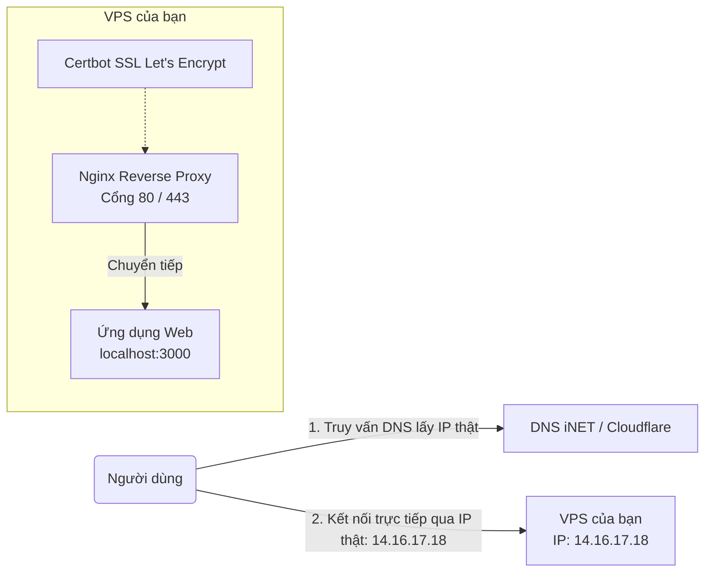
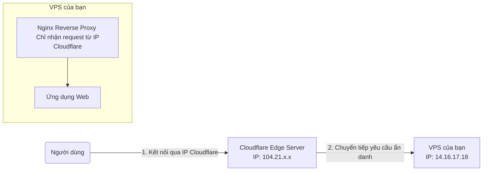
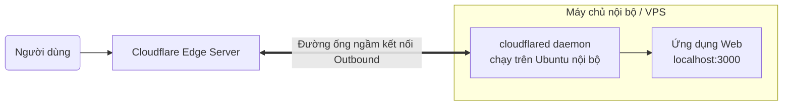

# Các Mô Hình Triển Khai: VPS Truyền Thống, Cloudflare Proxy và Cloudflare Tunnel

Tài liệu này phân tích chi tiết 3 mô hình triển khai ứng dụng phổ biến, từ mô hình tự vận hành truyền thống (Nginx + Certbot) đến mô hình sử dụng Proxy bảo vệ và mô hình đường ống ngầm (Tunnel).

---

## Mô Hình 1: VPS Trực Tiếp (Nginx + Certbot)

Đây là mô hình cơ bản và quen thuộc nhất đối với lập trình viên khi mới bắt đầu thuê VPS (DigitalOcean, Vultr, AWS...).

### Cơ chế hoạt động:
1. Bạn cấu hình bản ghi DNS loại **A** trỏ thẳng tên miền về IP công cộng (Public IP) của VPS: `14.16.17.18`.
2. Bạn cài đặt **Nginx** trên VPS để nhận yêu cầu từ cổng 80/443 rồi chuyển tiếp (Reverse Proxy) vào ứng dụng đang chạy ở cổng 3000.
3. Bạn chạy **Certbot** để lấy chứng chỉ SSL Let's Encrypt và cấu hình Nginx tự động gia hạn chứng chỉ này.

### Ưu & Nhược điểm:
*   **Ưu điểm:** Đơn giản, dễ kiểm soát hoàn toàn hệ thống cấu hình web server (Nginx).
*   **Nhược điểm:** 
    *   **Lộ IP thật:** Bất kỳ ai cũng có thể dùng lệnh `ping` hoặc `nslookup` để biết chính xác IP máy chủ của bạn.
    *   **Dễ bị tấn công:** Hacker có thể tấn công DDoS trực tiếp vào IP máy chủ của bạn, làm nghẽn băng thông và sập server mà không bộ lọc nào ngăn chặn.
    *   **Tự quản lý bảo mật:** Bạn phải tự cấu hình tường lửa (UFW/IPTables) để chặn các cổng nhạy cảm như cổng Database (5432, 3306) hay cổng SSH (22).

---

## Mô Hình 2: VPS Ẩn IP Qua Cloudflare Proxy (Doanh Nghiệp Phổ Biến)

Mô hình này nâng cấp từ mô hình 1 bằng cách bật đám mây màu cam (**Proxied**) trên trang quản lý DNS của Cloudflare.

### Cơ chế hoạt động:
1. **Ai quản lý IP?** Nhà cung cấp VPS vẫn cấp và quản lý IP thật `14.16.17.18` cho bạn. Tuy nhiên, thay vì hiển thị nó ra ngoài, Cloudflare sẽ đứng ra làm "khiên đỡ".
2. Khi người dùng truy cập web của bạn, họ thực chất đang kết nối tới IP của **Cloudflare** (`104.21.x.x`). Cloudflare nhận yêu cầu, kiểm tra an toàn, sau đó mới âm thầm gửi yêu cầu đó về IP thật `14.16.17.18` của bạn.
3. **Cơ chế bảo vệ:** Bạn cấu hình tường lửa trên VPS sao cho **chỉ chấp nhận kết nối chiều vào từ danh sách IP của Cloudflare**. Mọi kết nối trực tiếp từ IP khác đến cổng 80/443 của VPS đều bị drop/block thẳng tay.
4. Bạn không cần tự chạy Certbot nữa vì Cloudflare đã tự xử lý SSL ở đầu vào của họ.

### Ưu & Nhược điểm:
*   **Ưu điểm:**
    *   Ẩn hoàn toàn IP thật của VPS trước công chúng.
    *   Thừa hưởng miễn phí công nghệ chống DDoS cực mạnh của Cloudflare.
    *   Tối ưu tốc độ tải trang nhờ bộ nhớ đệm (CDN) của Cloudflare.
*   **Nhược điểm:** Bạn vẫn phải thuê VPS có Public IP tĩnh và phải cấu hình tường lửa VPS chuẩn xác để tránh bị hacker "vượt rào" scan ra IP thật.

---

## Mô Hình 3: Cloudflare Tunnel (Đường Ống Ngầm)

Đây là mô hình hiện đại nhất, loại bỏ hoàn toàn khái niệm Public IP chiều vào (Inbound) và mở cổng modem/máy chủ.

### Cơ chế hoạt động:
1. Bạn chạy chương trình `cloudflared` trên máy Ubuntu của mình. 
2. Chương trình này chủ động kết nối ra ngoài (Outbound) tới Cloudflare để tạo thành một **đường ống ngầm bảo mật song song**.
3. Khi người dùng truy cập tên miền, Cloudflare gửi dữ liệu đi ngược lại qua đường ống ngầm này để đưa tới ứng dụng web của bạn.
4. **Không cần mở cổng:** Bạn hoàn toàn có thể khóa 100% cổng kết nối chiều vào (Inbound) trên modem và máy chủ của bạn.

### Ưu & Nhược điểm:
*   **Ưu điểm:**
    *   An toàn nhất trong cả 3 cách vì hoàn toàn không mở cổng đón kết nối từ ngoài vào.
    *   Chạy được trên các máy tính đặt tại nhà, văn phòng công ty nằm sau các lớp tường lửa NAT phức tạp mà không có IP tĩnh.
*   **Nhược điểm:** 
    *   Hiệu năng truyền tải file siêu lớn (như video streaming) bị giới hạn bởi chính sách của Cloudflare.
    *   Phụ thuộc hoàn toàn vào dịch vụ của Cloudflare.

---

## Bảng So Sánh Tổng Hợp

| Tiêu Chí | Mô Hình 1: VPS Trực Tiếp | Mô Hình 2: Cloudflare Proxy | Mô Hình 3: Cloudflare Tunnel |
| :--- | :--- | :--- | :--- |
| **IP thật của máy chủ** | Bị lộ công khai | Được ẩn hoàn toàn | Được ẩn hoàn toàn (Không cần IP tĩnh) |
| **Yêu cầu mở cổng (Inbound)** | Cần mở cổng 80/443 | Cần mở cổng 80/443 (giới hạn theo IP Cloudflare) | Không cần mở bất kỳ cổng nào |
| **Quản lý SSL/HTTPS** | Tự cấu hình (Certbot) | Cloudflare tự quản lý | Cloudflare tự quản lý |
| **Khả năng chống DDoS** | Thấp (Dễ bị bypass) | Rất cao | Rất cao |
| **Môi trường phù hợp** | Cloud VPS | Cloud VPS | Local PC, Mạng văn phòng, Home-lab, Cloud VPS |
