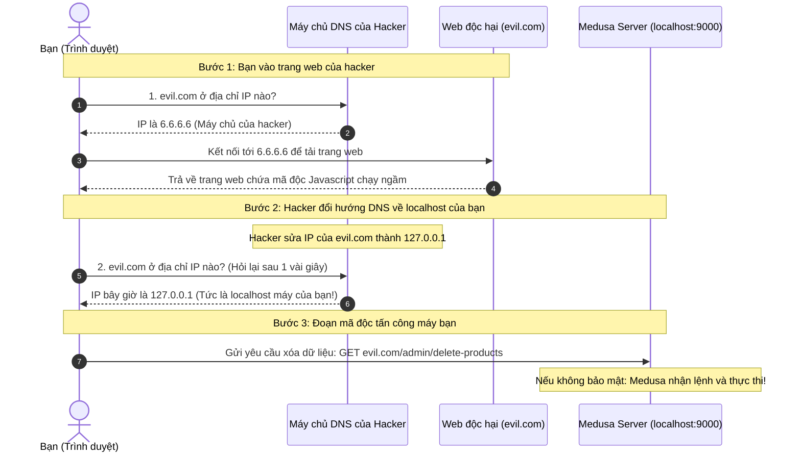

# DNS Rebinding Attack: Cơ Chế Tấn Công Và Cách Vite Bảo Vệ Bạn

Tài liệu này giải thích chi tiết bằng sơ đồ trực quan về kiểu tấn công **DNS Rebinding** (Tấn công phản xạ DNS) và lý do tại sao máy chủ phát triển Vite mặc định lại chặn tên miền Cloudflare Tunnel của bạn.

---

## 1. Bối Cảnh (Điểm Yếu Của Localhost)

Khi bạn lập trình ở local, bạn chạy Medusa ở địa chỉ `http://localhost:9000`. 
*   **Bạn nghĩ:** *"Máy chủ này chạy ở local, người ngoài Internet không thể truy cập được nên không cần bảo mật quá kỹ."*
*   **Thực tế:** Mặc dù người ngoài không thể kết nối trực tiếp vào `localhost` của bạn, nhưng **trình duyệt** của bạn thì có thể kết nối ra ngoài Internet để tải các trang web khác, và chạy mã JavaScript của họ. Đây chính là kẽ hở để hacker lợi dụng.

---

## 2. Kịch Bản Tấn Công DNS Rebinding (Từng bước)

Hãy xem sơ đồ luồng dưới đây để thấy hacker đã "lừa" trình duyệt của bạn truy cập vào máy cục bộ như thế nào:



### Tại sao trình duyệt lại bị lừa?
Trình duyệt có một cơ chế bảo mật gọi là **Same-Origin Policy** (Chính sách cùng nguồn gốc). Nó chỉ cho phép mã Javascript của trang `evil.com` gửi yêu cầu tới đúng tên miền `evil.com`. 
Do tên miền vẫn là `evil.com`, trình duyệt tin tưởng cho phép gửi yêu cầu đi. Trình duyệt không hề biết rằng hacker đã âm thầm thay đổi IP của `evil.com` từ máy chủ ngoài (`6.6.6.6`) thành máy cục bộ của bạn (`127.0.0.1`).

---

## 3. Cách Vite Chặn Đứng Cuộc Tấn Công (Host Header Check)

Để chống lại trò "lừa đảo" DNS Rebinding này, Vite (và các web server hiện đại) áp dụng một quy tắc kiểm tra rất nghiêm ngặt gọi là **Host Header Validation**:

1. Khi trình duyệt gửi yêu cầu tới máy cục bộ của bạn (ở Bước 3 phía trên), nó bắt buộc phải đính kèm một nhãn tiêu đề HTTP gọi là **`Host`**:
   ```http
   GET /admin/delete-products HTTP/1.1
   Host: evil.com
   ```
2. Máy chủ Vite nhận được yêu cầu, việc đầu tiên nó làm là đọc nhãn `Host`.
3. Vite kiểm tra xem tên miền `evil.com` có nằm trong danh sách trắng (**`allowedHosts`**) được phép truy cập hay không.
4. Mặc định, danh sách trắng này chỉ bao gồm `["localhost", "127.0.0.1"]`.
5. Vì `evil.com` không nằm trong danh sách trắng, Vite lập tức từ chối xử lý và trả về lỗi:
   > **Blocked request. This host is not allowed.**
6. Cuộc tấn công thất bại hoàn toàn!

---

## 4. Tại Sao Cloudflare Tunnel Lại Bị Ảnh Hưởng?

Khi bạn thiết lập Cloudflare Tunnel và truy cập qua tên miền: `https://api.hailinh.id.vn/app`

1. Trình duyệt của bạn sẽ gửi yêu cầu đi với nhãn:
   ```http
   Host: api.hailinh.id.vn
   ```
2. Yêu cầu đi xuyên qua Tunnel và chuyển tới máy chủ Vite cục bộ trên Ubuntu.
3. Vite đọc nhãn và thấy `Host: api.hailinh.id.vn`.
4. Vite thực hiện kiểm tra bảo mật giống như trên: *"Ủa, `api.hailinh.id.vn` không phải là `localhost`. Nó cũng không nằm trong danh sách trắng `allowedHosts`."*
5. Vite nghi ngờ đây là một cuộc tấn công DNS Rebinding nên đã **chặn đứng yêu cầu của bạn** để bảo vệ hệ thống.

### Cách chúng ta khắc phục:
Bằng cách cấu hình trong file [medusa-config.ts](file:///e:/Code/Medusa/my-medusa-store/apps/backend/medusa-config.ts):
```typescript
config.server.allowedHosts = ["api.hailinh.id.vn", "localhost"]
```
Bạn đã chính thức nói với Vite: *"Tên miền `api.hailinh.id.vn` là do tôi sở hữu và cấu hình qua Tunnel. Nó an toàn, hãy cho phép nó đi qua!"*

---

## 5. Giải Thích Các Thắc Mắc Thường Gặp

### "Tải trang web về" là sao? Tại sao phải tải về?
Khi bạn gõ một địa chỉ web (ví dụ `google.com` hay `evil.com`) rồi nhấn Enter:
1. Trình duyệt của bạn sẽ tải toàn bộ mã nguồn của trang web đó (gồm các file HTML, CSS và các file **JavaScript**) từ máy chủ web về và lưu tạm vào RAM máy tính của bạn.
2. Trình duyệt sẽ đóng vai trò là "máy ảo" trực tiếp chạy đống mã JavaScript đó trên máy của bạn để hiển thị giao diện và xử lý các nút bấm.
3. **Mối nguy hiểm:** Khi mã JavaScript đã được tải về máy bạn, nó có quyền thực thi các đoạn lệnh gửi yêu cầu mạng (Request) đi khắp nơi bằng chính mạng Internet của máy bạn. Do đó, hacker cần bạn truy cập vào web của họ để trình duyệt của bạn tự động tải đoạn mã độc đó về máy và kích hoạt nó.

---

### So sánh DNS Rebinding với CSRF và XSS

Bạn có linh cảm rất nhạy bén! Cả 3 đều là những kiểu tấn công bảo mật phía máy khách (Client-side), nhưng chúng nhắm vào các sơ hở hoàn toàn khác nhau:

#### 1. CSRF (Cross-Site Request Forgery - Giả mạo yêu cầu chéo)
*   **Kịch bản:** Bạn đã đăng nhập vào `facebook.com` (trình duyệt đang lưu Session Cookie). Hacker lừa bạn click vào một nút trên trang `evil.com`. Nút này gửi ngầm một yêu cầu đổi mật khẩu sang `facebook.com/change-password`.
*   **Sơ hở:** Trình duyệt tự động đính kèm Cookie đăng nhập của bạn khi gửi request sang Facebook, khiến Facebook tưởng là do chính bạn chủ động thực hiện.
*   **Khác biệt với DNS Rebinding:** CSRF gửi request **giữa hai tên miền khác nhau** (từ `evil.com` sang `facebook.com`).

#### 2. XSS (Cross-Site Scripting - Tiêm mã độc)
*   **Kịch bản:** Hacker tìm thấy một lỗi bảo mật trên trang web tin tức uy tín `dantri.com.vn` (ví dụ: phần bình luận cho phép gõ code HTML). Hacker viết bình luận chứa mã độc. Khi bạn vào đọc bài báo đó, trình duyệt của bạn tải mã độc này về và chạy.
*   **Sơ hở:** Hacker chèn mã độc vào **trang web uy tín** mà bạn tin tưởng.
*   **Khác biệt với DNS Rebinding:** Trang web bị tấn công là trang uy tín bị lỗi bảo mật. Trình duyệt tải mã độc trực tiếp từ tên miền uy tín đó.

#### 3. DNS Rebinding (Tấn công phản xạ DNS)
*   **Kịch bản:** Hacker không hack trang web nào cả. Họ tự lập trang web của họ (`evil.com`) và dụ bạn vào. Nhưng họ **tráo đổi địa chỉ IP** của tên miền `evil.com` từ máy chủ của họ về `127.0.0.1` (localhost của bạn) ngay sau khi bạn tải trang web về.
*   **Sơ hở:** Trình duyệt tin tưởng **Same-Origin Policy** (chỉ cho phép JavaScript của `evil.com` gọi request tới `evil.com`). Vì tên miền vẫn là `evil.com` nên trình duyệt cho phép gửi đi, mà không hề biết IP đã bị tráo về localhost.
*   **Khác biệt với CSRF/XSS:** DNS Rebinding vượt qua cơ chế Same-Origin Policy của trình duyệt bằng cách thay đổi cấu hình hệ thống phân giải tên miền (DNS).

---

### "Thay đổi DNS thường mất vài tiếng đến vài ngày, sao hacker đổi IP nhanh thế được?"
Đây là thắc mắc cực kỳ sắc bén! Bình thường khi bạn đổi IP ở iNET, phải mất từ vài tiếng đến cả ngày để tên miền nhận IP mới khắp thế giới (gọi là DNS Propagation). 

Hacker vượt qua rào cản này bằng 2 mẹo kỹ thuật sau:
1.  **Hạ TTL (Time to Live) về 0 hoặc 1 giây:** 
    *   TTL là thời gian trình duyệt hoặc các nhà mạng (như Viettel, FPT) lưu bộ nhớ đệm (Cache) của DNS. Nếu TTL là 24 tiếng, trình duyệt sẽ dùng IP cũ trong 24 tiếng mà không hỏi lại.
    *   Hacker tự dựng máy chủ DNS riêng và cấu hình **TTL = 0 hoặc 1 giây**. Trình duyệt sẽ hiểu là: *"Chỉ được tin IP này trong đúng 1 giây, sau 1 giây nếu muốn gửi yêu cầu mạng phải đi hỏi lại máy chủ DNS"*.
2.  **Sử dụng kỹ thuật chờ (Delay):**
    *   Sau khi trang web độc hại tải xong, đoạn mã JavaScript của hacker sẽ chạy ngầm và chủ ý đợi (ví dụ: dùng `setTimeout`) khoảng 2-3 giây. 
    *   Sau 3 giây, bộ nhớ đệm DNS cũ của trình duyệt đã hết hạn. Khi đoạn mã bắt đầu thực hiện đòn tấn công, trình duyệt bắt buộc phải truy vấn lại DNS Server và nhận ngay lập tức địa chỉ IP mới là `127.0.0.1` (localhost).
    *   Quá trình này diễn ra hoàn toàn tự động và **tức thì** ngay trong phiên lướt web của bạn mà không gặp hiện tượng trễ của DNS thông thường.
