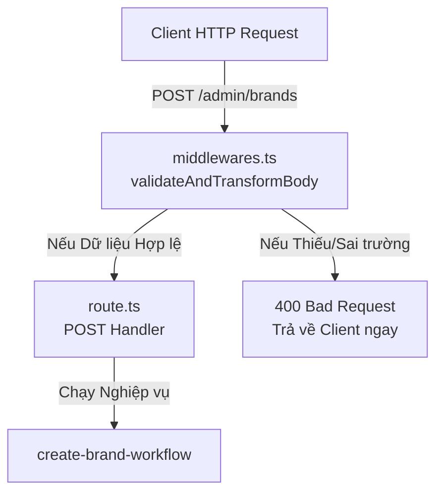

# So sánh Medusa v2 và Spring Boot cho Nhà phát triển Java

Tài liệu này đóng vai trò làm hướng dẫn so sánh, đối chiếu các khái niệm trong Medusa v2 (Node.js/TypeScript) với Spring Boot (Java) để giúp bạn dễ dàng làm quen và phát triển ứng dụng.

---

## 1. Bản đồ Đối chiếu Khái niệm (Concept Mapping)

| Khái niệm trong Medusa v2 | Khái niệm tương đương trong Spring Boot | Chi tiết so sánh |
| :--- | :--- | :--- |
| **Model** (`models/brand.ts`) | **JPA Entity** (`@Entity`, `@Table`) | Định nghĩa cấu trúc bảng dữ liệu, các cột, kiểu dữ liệu và khóa chính/phụ. |
| **Service** (`service.ts`) | **Repository** (`JpaRepository`) + **Service** (`@Service`) | Cung cấp các hàm xử lý logic nghiệp vụ và các phương thức CRUD cơ bản (`create`, `retrieve`, `update`, `delete`). |
| **Module** (`index.ts`) | **Spring Boot Starter / Configuration** (`@Configuration`) | Đóng gói một nghiệp vụ khép kín (Model, Service, API) và đăng ký vào Application Context của hệ thống. |
| **Dependency Injection** (`container.resolve`) | **Spring DI** (`@Autowired`, Constructor Injection) | Lấy ra một instance của Service đã được đăng ký trong Container quản lý (IOC Container). |
| **Migrations** | **Flyway / Liquibase** | Các file script để cập nhật cấu trúc cơ sở dữ liệu (Database Schema) một cách tuần tự và an toàn. |
| **Step** (`create-brand-step`) | **Saga Command / Transaction Component** | Một bước xử lý nghiệp vụ đơn lẻ trong một giao dịch phức tạp, đi kèm với hàm hoàn tác (Compensation/Rollback). |
| **Workflow** (`create-brand-workflow`) | **Saga Orchestrator / Camunda BPMN Workflow** | Điều phối một chuỗi các bước xử lý (Steps) liên tiếp, đảm bảo tính nhất quán dữ liệu (Distributed Transaction / Saga Pattern). |

---

## 2. Phân tích Chi tiết từng Commit

### 🚀 Commit 1: `fba398c` - feat(brand): create and register Brand Module with database migration

Commit này tạo ra cấu trúc cơ bản cho module **Brand** và đồng bộ nó vào PostgreSQL thông qua Migration.

#### A. Cấu trúc thư mục Module
Trong Spring Boot, bạn thường tổ chức theo package: `com.example.project.brand.entity`, `...repository`, `...service`.
Trong Medusa v2, các module tự định nghĩa được đặt trong thư mục `src/modules/<tên-module>/`:
```
src/modules/brand/
├── models/
│   └── brand.ts        # Model (Entity)
├── migrations/         # Database Migrations
├── index.ts            # Entrypoint đăng ký Module
└── service.ts          # Module Service (CRUD + Logic)
```

#### B. Model (`models/brand.ts`) vs JPA Entity
* **Medusa v2 (`brand.ts`):**
  ```typescript
  import { model } from "@medusajs/framework/utils";

  export const Brand = model.define("brand", {
      id: model.id().primaryKey(),
      name: model.text(),
  })
  ```
* **Spring Boot (JPA Entity):**
  ```java
  @Entity
  @Table(name = "brand")
  public class Brand {
      @Id
      @GeneratedValue(strategy = GenerationType.UUID)
      private String id;

      @Column(nullable = false)
      private String name;
      
      // getters, setters
  }
  ```
👉 **Điểm tương đồng**: Cả hai đều dùng ORM (Medusa dùng MikroORM dưới dạng ẩn, Spring Boot dùng Hibernate) để ánh xạ class/model thành bảng trong database.

#### C. Service (`service.ts`) vs Repository & Service
* **Medusa v2 (`service.ts`):**
  ```typescript
  import { MedusaService } from "@medusajs/framework/utils";
  import { Brand } from "./models/brand"

  export class BrandModuleService extends MedusaService({
      Brand,
  }) {}
  ```
* **Spring Boot:**
  ```java
  // 1. Repository
  public interface BrandRepository extends JpaRepository<Brand, String> {}

  // 2. Service
  @Service
  public class BrandModuleService {
      @Autowired
      private BrandRepository brandRepository;
      
      // Bạn phải tự viết các hàm CRUD hoặc gọi qua repository
  }
  ```
👉 **Sự tiện lợi của Medusa v2**: Khi kế thừa `MedusaService({ Brand })`, Medusa tự động sinh ra toàn bộ các hàm CRUD như `createBrands()`, `retrieveBrands()`, `updateBrands()`, `deleteBrands()` mà bạn không cần code một dòng nào trong class Service cả.

#### D. Đăng ký Module (`index.ts`) vs Spring `@Configuration`
* **Medusa v2 (`index.ts`):**
  ```typescript
  import { Module } from "@medusajs/framework/utils"
  import { BrandModuleService } from "./service"

  export const BRAND_MODULE = "brand"
  export default Module(BRAND_MODULE, {
      service: BrandModuleService,
  })
  ```
👉 **Ý nghĩa**: Báo cho Medusa framework biết có một module tên là `"brand"` sử dụng service `BrandModuleService`. Sau khi khai báo ở đây và thêm vào `medusa-config.ts`, bạn có thể inject module này ở bất cứ đâu bằng từ khóa `brand` (tương đương với `@Qualifier("brand")` hoặc `@Autowired`).

---

### 🔄 Commit 2: `65ac7ad` - create step and workflows

Commit này xây dựng luồng xử lý nghiệp vụ (Business Workflow) để tạo mới một Brand.

#### A. Step (`workflows/steps/create-brand.ts`) vs Saga Step
Trong Spring Boot thông thường, bạn viết một hàm `@Transactional` để thực hiện nghiệp vụ. Nhưng nếu xảy ra lỗi giữa chừng sau khi đã gọi API ngoài (như cổng thanh toán, gửi email), `@Transactional` của DB không thể rollback lại hành động trên API đó.
Medusa giải quyết bằng **Saga Pattern** thông qua **Step**:

* **Medusa v2 Step:**
  ```typescript
  export const createBrandStep = createStep(
    "create-brand-step",
    // 1. Hàm chạy chính (Execute)
    async (input: CreateBrandStepInput, { container }) => {
      const brandModuleService = container.resolve("brand") // Tương đương @Autowired
      const brand = await brandModuleService.createBrands(input)
      return new StepResponse(brand, brand.id) // Lưu id vào state để phục vụ hoàn tác
    },
    // 2. Hàm hoàn tác (Compensate / Rollback)
    async (brandId, { container }) => {
      if (!brandId) return
      const brandModuleService = container.resolve("brand")
      await brandModuleService.deleteBrands(brandId) // Nếu bước sau lỗi, xóa brand đã tạo đi
    }
  )
  ```
* **Spring Boot (Ví dụ giả lập Saga):**
  Trong Spring Boot, để làm điều này bạn phải dùng thư viện như Axon Framework, Temporal, hoặc tự try-catch thủ công:
  ```java
  @Component
  public class CreateBrandStep {
      @Autowired
      private BrandModuleService brandService;

      public Brand execute(CreateBrandInput input) {
          return brandService.createBrand(input);
      }

      public void compensate(String brandId) {
          brandService.deleteBrand(brandId);
      }
  }
  ```

#### B. Workflow (`workflows/create-brand.ts`) vs Saga Orchestrator / Transactional Service
Workflow là tập hợp của nhiều Step được chạy theo một sơ đồ (Graph).

* **Medusa v2 Workflow:**
  ```typescript
  export const createBrandWorkflow = createWorkflow(
      "create-brand",
      function (input: CreateBrandWorkflowInput) {
          const brand = createBrandStep(input)
          return new WorkflowResponse(brand)
      }
  )
  ```
* **Spring Boot (Bản chất tương đương):**
  ```java
  @Service
  public class BrandWorkflow {
      @Autowired
      private CreateBrandStep createBrandStep;

      public BrandResponse run(CreateBrandInput input) {
          try {
              Brand brand = createBrandStep.execute(input);
              // Giả sử có step 2 lỗi ở đây:
              // sendNotificationStep.execute();
              return new BrandResponse(brand);
          } catch (Exception e) {
              // Phải tự gọi tay hàm compensate để rollback
              createBrandStep.compensate(lastBrandId);
              throw e;
          }
      }
  }
  ```

⚠️ **Quy tắc vàng của Workflow Constructor trong Medusa**:
1. **Không dùng `async/await`**: Vì Medusa chỉ chạy hàm này lúc khởi động để "vẽ" ra bản đồ luồng (Execution Graph) chứ không thực thi trực tiếp lúc khai báo.
2. **Không dùng cấu trúc rẽ nhánh `if/else` hoặc vòng lặp `for/while`**: Nếu muốn rẽ nhánh phải dùng hàm helper `when()` của Medusa. Vì đồ thị workflow phải tĩnh (static DAG).

---

## 3. Cấu trúc API, Định tuyến & Validation (Routing & Middlwares)

Trong commit `ba79457` (tiếp nối các commit trước), bạn đã tạo ra bộ ba file xử lý API cho request:
* `validators.ts` (Kiểm tra dữ liệu đầu vào)
* `middlewares.ts` (Bộ lọc chặn và validate dữ liệu)
* `route.ts` (Controller nhận request và trả về kết quả)

Dưới đây là so sánh chi tiết luồng xử lý này với Spring Boot:



### A. Định nghĩa Validation Schema (`validators.ts`) vs Request DTO
* **Medusa v2 (Dùng Zod):**
  ```typescript
  import { z } from "zod"
  
  export const PostAdminCreateBrand = z.object({
      name: z.string(), // name bắt buộc là string
  })
  export type PostAdminCreateBrandType = z.infer<typeof PostAdminCreateBrand>
  ```
* **Spring Boot (Request DTO với Validation):**
  ```java
  public class PostAdminCreateBrandRequest {
      @NotBlank(message = "Name is required")
      private String name;

      // getters, setters
  }
  ```
👉 **Bản chất**: Zod Schema định nghĩa cấu trúc dữ liệu mong muốn từ client. Cả hai cách đều nhằm mục đích tạo ra một chiếc "khuôn" để ép kiểu dữ liệu từ JSON gửi lên thành Object trong Code.

### B. Bộ lọc validation (`middlewares.ts`) vs `@Valid` & Interceptor
* **Medusa v2 (`middlewares.ts`):**
  ```typescript
  export default defineMiddlewares({
      routes: [
          {
              matcher: "/admin/brands",
              method: "POST",
              middlewares: [
                  validateAndTransformBody(PostAdminCreateBrand), // Dùng Zod để check body
              ],
          },
      ],
  })
  ```
* **Spring Boot (Tương đương cơ chế tự động Validation):**
  Trong Spring Boot, khi bạn dùng `@Valid` ở tham số đầu vào của Controller, Spring MVC sẽ tự động gọi validator (Hibernate Validator) để kiểm tra DTO trước khi đưa nó vào logic của hàm:
  ```java
  // Spring tự động validate dữ liệu, nếu lỗi sẽ trả về 400 và không chạy tiếp code bên dưới
  public ResponseEntity<?> createBrand(@Valid @RequestBody PostAdminCreateBrandRequest request) { ... }
  ```
👉 **Điểm cần lưu ý**: Trong Medusa, file này bắt buộc phải đặt tên chính xác là `middlewares.ts` ở thư mục `src/api/` để hệ thống tự động quét và áp dụng. Nó đóng vai trò như một **Filter/Interceptor** cấu hình tập trung.

### C. Xử lý Request (`route.ts`) vs RestController (`@PostMapping`)
* **Medusa v2 (`route.ts`):**
  ```typescript
  export const POST = async (
      req: MedusaRequest<PostAdminCreateBrandType>,
      res: MedusaResponse
  ) => {
      // 1. req.scope tương đương IoC Container của request hiện tại
      // 2. Chạy workflow với dữ liệu đã validate ở middleware
      const { result } = await createBrandWorkflow(req.scope).run({
          input: req.validatedBody,
      })
      // 3. Trả về JSON
      res.json({ brand: result })
  }
  ```
* **Spring Boot RestController:**
  ```java
  @RestController
  @RequestMapping("/admin/brands")
  public class BrandController {

      @Autowired
      private BrandWorkflow brandWorkflow; // createBrandWorkflow

      @PostMapping
      public ResponseEntity<?> createBrand(@Valid @RequestBody PostAdminCreateBrandRequest request) {
          // req.scope được ẩn đi, Spring tự động inject qua @Autowired
          Brand result = brandWorkflow.run(request);
          return ResponseEntity.ok(new BrandResponse(result));
      }
  }
  ```
👉 **Quy tắc định tuyến (Routing)**:
* **Spring Boot**: Định tuyến dựa trên Annotation (`@RequestMapping("/admin/brands")`).
* **Medusa v2**: Định tuyến dựa trên **Cấu trúc thư mục (File-based Routing)**. 
  * File đặt tại thư mục `src/api/admin/brands/route.ts` sẽ tự động map với URL `/admin/brands`.
  * Các Method HTTP được định nghĩa bằng cách `export const POST` (hoặc `GET`, `PUT`, `DELETE`...) viết hoa.

---

## 4. req.scope là gì? (Dependency Injection Container cho mỗi Request)

Khi gọi Workflow trong `route.ts`, bạn thấy cú pháp:
```typescript
createBrandWorkflow(req.scope).run(...)
```

### A. Giải thích về `req.scope`
`req.scope` là một **Request-scoped Dependency Injection (DI) Container** (được cung cấp bởi thư viện `Awilix` trong Medusa).

Để hiểu đơn giản:
* **Singleton Container**: Trong cả Spring Boot và Medusa, khi server khởi động, các class Service (như `@Service` hoặc `BrandModuleService`) được tạo ra **1 lần duy nhất** (Singleton) và lưu vào Container chung.
* **Request Container (`req.scope`)**: Với mỗi lượt Request HTTP từ client gửi đến, Medusa sẽ tạo ra một Container "con" (Child Container) tạm thời chỉ tồn tại trong vòng đời của Request đó. Container này chính là `req.scope`.

### B. Ánh xạ sang Spring Boot
Trong Spring Boot, `req.scope` tương đương với **`RequestContext`** kết hợp với **`@Scope("request")`** (Request Scoped Beans).

Khi bạn khai báo một Spring Bean có Scope là Request:
```java
@Component
@Scope(value = WebApplicationContext.SCOPE_REQUEST, proxyMode = ScopesProxyMode.TARGET_CLASS)
public class RequestScopedBean {
    // Bean này được tạo mới cho mỗi request và bị hủy khi request kết thúc
}
```
Mỗi khi bạn gọi các Service khác nhau trong cùng một Request, Spring tự động ngầm phân tách dữ liệu context (như Transaction hiện tại, User đang đăng nhập, Db Connection...) giữa các request với nhau thông qua ThreadLocal.

Còn trong Medusa (Node.js là Single-threaded), để không bị lẫn lộn dữ liệu giữa Request của User A và User B, Medusa bắt buộc phải chuyển Container `req.scope` của chính request đó đi qua các hàm để làm điểm neo.

### C. Tại sao Workflow cần `req.scope`?
1. **Để Resolve Service**: Workflow không thể tự tạo ra các Service (như `brandModuleService`). Nó cần `req.scope` để gọi `container.resolve("brand")` giải quyết Dependency Injection.
2. **Đảm bảo tính cô lập (Isolation)**: Giúp Workflow biết chính xác context của request hiện tại là gì (Ví dụ: Ai đang gọi API, tenant nào đang kết nối, Database Connection / Transaction nào đang hoạt động).
3. **Quản lý Transaction**: Giúp đồng bộ hóa Transaction từ Controller xuống Workflow và các Step. Nếu một bước lỗi, cả Transaction gắn với `req.scope` đó sẽ được rollback đồng bộ.

---

## 5. Module Links & Workflow Hooks (Commit `92383a9` - step-3-part 1)

Commit này giải quyết bài toán: **Liên kết sản phẩm (Product) với thương hiệu (Brand)** và **chèn logic này vào quy trình tạo sản phẩm mặc định** của Medusa.

### A. Module Link (`src/links/product-brand.ts`) vs JPA Joint Table / Foreign Key
Vì Medusa v2 thiết kế theo kiến trúc Modular rất chặt chẽ (giống Microservices thu nhỏ), mỗi Module quản lý một Database/Table riêng và hoàn toàn độc lập với nhau. Bạn **không thể** thêm cột `brand_id` trực tiếp vào bảng `product` của Core Medusa, vì module Product không được phép biết đến sự tồn tại của module custom `Brand`.

Để giải quyết liên kết ngoại lai này, Medusa dùng **Link**:
* **Medusa v2 (`product-brand.ts`):**
  ```typescript
  import BrandModule from "../modules/brand"
  import ProductModule from "@medusajs/medusa/product"
  import { defineLink } from "@medusajs/framework/utils"

  export default defineLink(
      {
          linkable: ProductModule.linkable.product,
          isList: true, // Một Brand có thể có nhiều Product
      },
      BrandModule.linkable.brand
  )
  ```
  Hệ thống sẽ tự sinh ra một bảng trung gian trong Database có tên là `product_brand` (chứa `product_id` và `brand_id`) để kết nối 2 module lại.

* **Spring Boot (Liên kết thông thường):**
  Trong Spring Boot, nếu hai Entity nằm chung một ứng dụng Monolith, bạn chỉ cần dùng `@ManyToOne` ở lớp `Product`:
  ```java
  @Entity
  public class Product {
      @ManyToOne
      @JoinColumn(name = "brand_id")
      private Brand brand;
  }
  ```
  *Nhưng nếu bạn làm hệ thống Microservices*, bạn sẽ có 2 service riêng: Product Service và Brand Service. Lúc này bạn phải viết một Link Service trung gian hoặc lưu liên kết ở một DB khác. Cách tiếp cận của Medusa v2 tương tự như vậy, nó giúp các module hoàn toàn tách biệt ở mức Database.

---

### B. Workflow Hook (`src/workflows/hooks/created-product.ts`) vs AOP / Events
Khi người dùng tạo một sản phẩm mới, Medusa chạy một Workflow mặc định của hệ thống gọi là `createProductsWorkflow`. Bạn muốn "chen chân" vào giữa quy trình này để gắn thêm `brand_id` vào sản phẩm vừa tạo. Medusa cung cấp cơ chế **Workflow Hook**:

* **Medusa v2 (`created-product.ts`):**
  ```typescript
  // Chen chân vào hook "productsCreated" của Workflow mặc định
  createProductsWorkflow.hooks.productsCreated(
      async ({ products, additional_data }, { container }) => {
          // 1. Kiểm tra đầu vào
          if (!additional_data?.brand_id) return new StepResponse([], [])
          
          // 2. Validate xem Brand có tồn tại thật không
          const brandModuleService = container.resolve("brand")
          await brandModuleService.retrieveBrand(additional_data.brand_id)

          // 3. Liên kết Product vừa tạo với Brand qua bảng Link
          const link = container.resolve("link")
          const links = products.map(p => ({
              [Modules.PRODUCT]: { product_id: p.id },
              [BRAND_MODULE]: { brand_id: additional_data.brand_id }
          }))
          await link.create(links)

          return new StepResponse(links, links)
      },
      // HÀM HOÀN TÁC: Nếu các bước sau trong quy trình tạo sản phẩm bị lỗi, tự động xóa liên kết
      async (links, { container }) => {
          const link = container.resolve("link")
          await link.dismiss(links)
      }
  )
  ```

* **Spring Boot (Tương đương cơ chế Event hoặc AOP):**
  Trong Spring Boot, cơ chế này cực kỳ giống việc bạn dùng **Spring Application Events (`@EventListener`)** hoặc **Hibernate Entity Listeners (`@PostPersist`)**.
  
  ```java
  @Component
  public class ProductCreatedListener {

      @Autowired
      private LinkService linkService; // Dịch vụ liên kết

      @EventListener // Chờ sự kiện ProductCreatedEvent
      @Transactional
      public void handleProductCreated(ProductCreatedEvent event) {
          Product product = event.getProduct();
          String brandId = event.getAdditionalData().get("brand_id");
          
          if (brandId != null) {
              // Thực hiện liên kết
              linkService.createLink(product.getId(), brandId);
          }
      }
  }
  ```
  **Điểm khác biệt**: Spring `@EventListener` mặc định không hỗ trợ tự động rollback (Compensation) một cách bài bản nếu các tiến trình bất đồng bộ phía sau bị lỗi. Workflow Hook của Medusa tích hợp chặt chẽ với cơ chế Saga, đảm bảo nếu tạo sản phẩm thất bại ở bước sau thì liên kết vừa tạo cũng sẽ được "dismiss" (xóa bỏ) an toàn.

